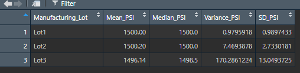
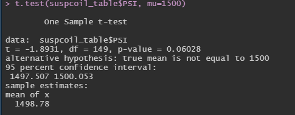
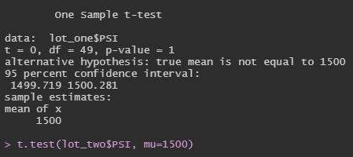
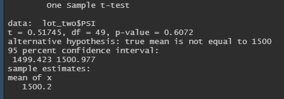
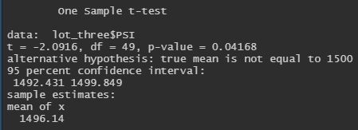

# MechaCar_Statistical_Analysis

## Project Overview
In this project, statistics and hypothesis testing is used to analyze a series of datasets from the automotive industry using R programming language. 

## Tools and Techniques 
R-programmig, tidyverse, ggpot2, Statistical Tests, Hypothesis Testing, A/B Testing 

## Linear Regression to Predict MPG

Interprepation of the multiple linear regression results: 
- According to the results vehicle length, ground clearance and intercept have provided a non-random amount of variance to mpg values in the dataset. Therefore ground clearance and vehicle length have a sigificant mpace on the mpg. Also, the intercept is statistically significant which means that there are other variables that do contribute in mpg that have not been included in the model. Spoiler angle, AWD and Vehicle weight contributes a random amount of variance to this linear model. 
- Assuming a significance level of 0.05%, the p-va;ue of this linear model is 5.35e-11 and much smaller than our significance level. Therefore, we do not have enough evidence to reject the null hypothesis and that is why the slope of the linear model is not zero. 
- In this linear model the r-squared value is 0.7149 which means approximately 71% of all the mpg predictions will be correct when using this model. Therefore, we can state that this linear model predicts mpg of MechaCar prototypes effectively.  

## Summary Statistics on Suspension Coils 

The design specifications for the MechaCar suspension coils dictate that the variance of the suspension coils must not exceed 100 pounds per inch. From the above data from the total summary for all the lots the variance is approximately 62 pounds per inch which is below the specified value. Hence the current manufacuting data meets this design specification. 

The design specifications for the MechaCar suspension coils dictate that the variance of the suspension coils must not exceed 100 pounds per inch. From the above data we can see that the variance for Lot 1 and Lot 2 are 0.98 and 7.47 respectively. Hence the current manufacturing data for Lot 1 and Lot 2 meet this design specification. However, the variance for Lot 3 is 170 approximatey which is above the design specifications and therefore do not meet the design specifications. 

## T-Tests on Suspension Coils 

Assuming the significance level of 0.05 percent, p-value (0.06028) is above our significance level. Therefore, we do not have enough evidence to support to reject the null hypothesis, and we would state that the two means are statistically similar. 

For Suspension Coils in Lot one assuming the significance level of 0.05 percent, p-value (1) is above our significance level. Therefore, we do not have enough evidence to support to reject the null hypothesis, and we would state that the two means are statistically similar. 

For Suspension Coils in Lot two assuming the significance level of 0.05 percent, p-value (0.6072) is above our significance level. Therefore, we do not have enough evidence to support to reject the null hypothesis, and we would state that the two means are statistically similar. 

For Suspension Coils in Lot three assuming the significance level of 0.05 percent, p-value (0.04168) is below our significance level. Therefore, we have enough evidence to reject the null hypothesis, and we would state that the two means are statistically different. 

## Study Design: MechaCar vs Competition 

There will be many metrics that will be of interest of the customer. Some of these metrics are fuel efficiency, cost of ownership, reliability etc. By looking at different statistical tests relating to this metrics MechaCar can outperform their competition. 

- Fuel Efficiency: Fuel efficiency measures how far a car can travel per unit of fuel and is an imporant factor when customers decide to buy a vehicle. We can use a one way ANOVA test for this purpose which is used to compare means of a single dependent variable across a single independent variable with multiple groups for example fuel efficiency of different cars based on vehicle class. The null hypothesis is that the means of mpg across all of the groups are equal and the alternative hypothesis is that at least one of the means is different from all other groups. For this analysis we would need a dataset containing fuel efficiency in mpg of different vehicles across different vehicle types. 
- Horsepower: A measure of a cars horsepower indicated the performance and how fast the vehicle will be. Mechacars can do an analysis to see if cars with more horsepower sells more or less. Therefore the null hypothesis would be that horsepower has no impact in car sales and the alternative hypothesis would be that sales are tied to a cars horsepower and therefore speed. We can do a simple linear regression because we will be seeing for a given horsepower which is continous and our independent variable how our sales which is also continous and our dependent variable is affected. For this analysis we would need a dataset with totl car sales for their respective horsepower. 
- Cost: Customers usually would consider the long term cost of ownerhip of a car when buying a car. The question would be if the cost of MechaCars is less than that of the competition. Therefore Null hypothesis would be the means of cost of all cars across all groups are equal and the alternate hypothesis would be that atleast one of the means is different from all other groups. Therefore we can perform the ANOVA test in which we need to have mainly cost and fuel efficiency data of all the concerned manufactureres. 

