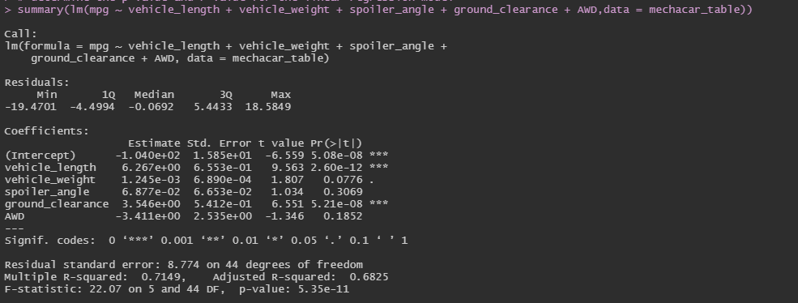

# MechaCar_Statistical_Analysis

## Project Overview
In this project, statistics and hypothesis testing is used to analyze a series of datasets from the automotive industry using R programming language. 

## Tools and Techniques 
R-programmig, tidyverse, ggpot2, Statistical Tests, Hypothesis Testing, A/B Testing 

## Linear Regression to Predict MPG

Interprepation of the multiple linear regression results: 
- According to the results vehicle length, ground clearance and intercept have provided a non-random amount of variance to mpg values in the dataset. Therefore ground clearance and vehicle length have a sigificant mpace on the mpg. Also, the intercept is statistically significant which means that there are other variables that do contribute in mpg that have not been included in the model. Spoiler angle, AWD and Vehicle weight contributes a random amount of variance to this linear model. 
- Assuming a significance level of 0.05%, the p-va;ue of this linear model is 5.35e-11 and much smaller than our significance level. Therefore, we do not have enough evidence to reject the null hypothesis and that is why the slope of the linear model is not zero. 
- In this linear model the r-squared value is 0.7149 which means approximately 71% of all the mpg predictions will be correct when using this model. Therefore, we can state that this linear model predicts mpg of MechaCar prototypes effectively.  
